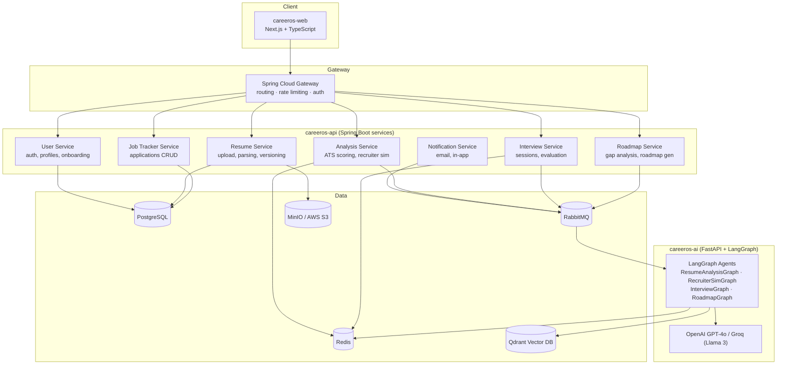

# CareerOS Architecture

CareerOS is an open-source, AI-powered Career Operating System built as a set of microservices behind an API gateway, with a dedicated AI layer for LangGraph-based agents.

This document explains how the services fit together, who owns what, how data flows through two key features (Resume Analysis and Interview Sessions), and how to run the whole system locally.

## 1. High-Level Architecture



**Plain-text fallback** (if Mermaid doesn't render in your viewer):

```
                          ┌─────────────────────┐
                          │   careeros-web       │
                          │  (Next.js frontend)  │
                          └──────────┬───────────┘
                                     │ HTTPS
                          ┌──────────▼───────────┐
                          │ Spring Cloud Gateway  │
                          │ (auth, routing, rate  │
                          │      limiting)        │
                          └──────────┬───────────┘
        ┌───────────┬────────────────┼────────────────┬───────────┐
        ▼           ▼                ▼                ▼           ▼
   ┌────────┐  ┌──────────┐   ┌─────────────┐  ┌────────────┐ ┌─────────┐
   │  User  │  │ Resume   │   │  Analysis   │  │ Interview  │ │  Job    │
   │Service │  │ Service  │   │  Service    │  │  Service   │ │ Tracker │
   └───┬────┘  └────┬─────┘   └──────┬──────┘  └─────┬──────┘ └────┬────┘
       │            │                 │               │              │
       │            ▼                 └───────┬───────┘              │
       │      MinIO/S3 (files)                │                      │
       │                                       ▼                      │
       │                              RabbitMQ (async jobs)           │
       │                                       │                      │
       │                                       ▼                      │
       │                      ┌───────────────────────────────┐       │
       │                      │   careeros-ai (FastAPI)        │       │
       │                      │   LangGraph Agents ──▶ LLMs    │       │
       │                      │   (OpenAI GPT-4o / Groq)       │       │
       │                      └────────────────┬───────────────┘       │
       │                                       ▼                      │
       │                                  Qdrant (vectors)             │
       ▼                                                               ▼
  PostgreSQL  ◀─────────────────────── Redis (cache/session) ──────────┘
```

## 2. Service Responsibility Table

| Service | Repo | Responsibility | Tech |
|---|---|---|---|
| **Web Frontend** | `careeros-web` | UI for all modules (resume upload, interview, tracker, roadmap, LinkedIn optimizer) | Next.js 14, TypeScript, Tailwind, shadcn/ui, React Query, Zustand |
| **API Gateway** | `careeros-api` | Single entry point: routing, rate limiting, auth enforcement | Spring Cloud Gateway |
| **User Service** | `careeros-api` | Registration, login, JWT issuance, profile & preferences | Spring Boot, Spring Security, JWT, PostgreSQL |
| **Resume Service** | `careeros-api` | Resume upload, text extraction, storage, versioning | Spring Boot, Apache Tika, MinIO |
| **Analysis Service** | `careeros-api` | ATS scoring, recruiter simulation (calls AI layer) | Spring Boot, Qdrant client |
| **Interview Service** | `careeros-api` | Interview session lifecycle, question/answer state | Spring Boot, Redis |
| **Job Tracker Service** | `careeros-api` | Application CRUD, reminders, pipeline analytics | Spring Boot, PostgreSQL |
| **Roadmap Service** | `careeros-api` | Skill gap analysis, roadmap generation, progress tracking | Spring Boot, LangGraph (via AI service) |
| **Notification Service** | `careeros-api` | Email reminders, in-app notifications | Spring Boot, RabbitMQ, SMTP |
| **AI Service** | `careeros-ai` | LangGraph agents for resume/recruiter/interview/roadmap reasoning | FastAPI, LangGraph, LangChain, sentence-transformers |
| **Docs** | `careeros-docs` | Architecture, contribution guides, roadmap | Markdown |

Shared infrastructure: **PostgreSQL** (system of record), **Redis** (cache/session/interim AI results), **Qdrant** (embeddings/semantic search), **RabbitMQ** (async job queue), **MinIO/S3** (file storage).

## 3. Data Flow: Resume Analysis

1. User uploads a resume (PDF/DOCX) from `careeros-web` via drag-and-drop.
2. Request hits the **API Gateway**, which authenticates the JWT and routes to the **Resume Service**.
3. **Resume Service** stores the raw file in **MinIO/S3**, extracts text with **Apache Tika**, and saves a `Resume` record (with `parsed_text`) in **PostgreSQL**.
4. Frontend calls `POST /api/resumes/{id}/analyze`. The **Analysis Service** publishes an analysis job to **RabbitMQ**.
5. The **AI Service** (`careeros-ai`) consumes the job and runs the `ResumeAnalysisGraph`:
   `parse → extract → score → generate-feedback → format-output`.
   - Keyword/semantic comparisons use **Qdrant** embeddings.
   - Scoring calls **OpenAI GPT-4o** (or **Groq/Llama 3** for faster paths).
6. The result (ATS score 0–100, keyword gaps, formatting issues) is written back and cached in **Redis** for fast polling.
7. Frontend polls `GET /api/resumes/{id}/analysis` until the async job completes, then renders the score breakdown and suggestions.

## 4. Data Flow: Interview Session

1. User selects role, target company, interview type, and difficulty in `careeros-web`.
2. `POST /api/interviews/sessions` hits the **Interview Service**, which creates an `InterviewSession` row in **PostgreSQL** and initializes session state in **Redis**.
3. The **Interview Service** requests a question set from the **AI Service**, which runs the `InterviewGraph`:
   `load-context → generate-questions → evaluate-answer → generate-feedback → update-session`.
   - Context is pulled from the user's active resume plus target company/role.
4. As the user answers (text now, voice in Phase 2), `POST /api/interviews/sessions/{id}/answer` triggers the AI Service to evaluate the answer against the rubric (technical accuracy, clarity, depth, relevance, STAR format), using **Groq/Llama 3** for low-latency scoring.
5. Interim scores and session state live in **Redis** for fast, real-time feedback; hints (`/hint` endpoint) are generated on demand without revealing the answer.
6. On `POST /api/interviews/sessions/{id}/complete`, the full session (questions, answers, per-question feedback, overall score) is persisted to **PostgreSQL** and a scorecard is returned to the frontend.

## 5. Local Development Setup

CareerOS uses Docker Compose for local development. Each repo can also be run standalone against the shared infra below.

**Prerequisites:** Docker & Docker Compose, Node.js 20+, Java 17+, Python 3.11+.

```bash
# 1. Clone the repos you need (at minimum: careeros-api and careeros-web)
git clone https://github.com/career-os/careeros-web.git
git clone https://github.com/career-os/careeros-api.git
git clone https://github.com/career-os/careeros-ai.git
git clone https://github.com/career-os/careeros-docs.git

# 2. Start shared infrastructure (Postgres, Redis, Qdrant, RabbitMQ, MinIO)
cd careeros-api
docker compose up -d postgres redis qdrant rabbitmq minio

# 3. Run the backend services
./mvnw spring-boot:run   # repeat per service module, or use the provided multi-module compose file

# 4. Run the AI service
cd ../careeros-ai
python -m venv .venv && source .venv/bin/activate
pip install -r requirements.txt
uvicorn main:app --reload --port 8000

# 5. Run the frontend
cd ../careeros-web
npm install
npm run dev   # http://localhost:3000
```

Environment variables (`.env` in each repo) need at minimum: `DATABASE_URL`, `REDIS_URL`, `QDRANT_URL`, `RABBITMQ_URL`, `S3_ENDPOINT`, `OPENAI_API_KEY`, `GROQ_API_KEY`, `JWT_SECRET`. See each repo's `CONTRIBUTING.md` for the full list.

## 6. Service Repositories

- **Frontend:** [career-os/careeros-web](https://github.com/career-os/careeros-web)
- **Backend services (User, Resume, Analysis, Interview, Job Tracker, Roadmap, Notification):** [career-os/careeros-api](https://github.com/career-os/careeros-api)
- **AI layer (LangGraph agents, FastAPI):** [career-os/careeros-ai](https://github.com/career-os/careeros-ai)
- **Documentation (this repo):** [career-os/careeros-docs](https://github.com/career-os/careeros-docs)